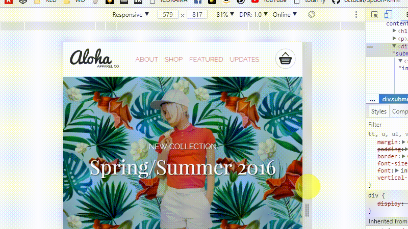

# Project Title

Red first Project 'ALOHA'. It is a simple static home page, and it is responsive to mobile, tablet and desktop.

## Code Example



```
@media screen and (min-width: 480px) {
  #navigation {
    flex-wrap: nowrap;
    ul {
      margin: auto;
      border-top-style: hidden;
      padding: 0;
      display: flex;
      width: 300px;
      justify-content: space-between;
    }
    &>.logo {
      order: 1;
    }
    &>ul {
      order: 2;
    }
    &>.cart {
      order: 3;
    }
  }
```
change navigation style by reordering the elements within.


## Installation

<ol>
<li>copy the repo </li>
<li>a url that resolves to package.json</li>
<li>npm install</li>
</ol>


## Development

To fix a bug or enhance an existing module, follow these steps:

<ul>
<li>Create a new branch (git checkout -b improve-feature)</li>
<li>Make the appropriate changes in the files</li>
<li>Add changes to reflect the changes made</li>
<li>Commit your changes (git commit -am 'Improve feature')</li>
<li>Push to the branch (git push origin improve-feature)</li>
<li>Create a Pull Request</li>
</ul>


## Contributors

Ning Yu Luo @NinGTX

## License

open source